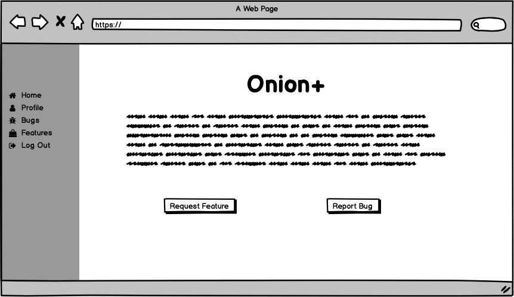
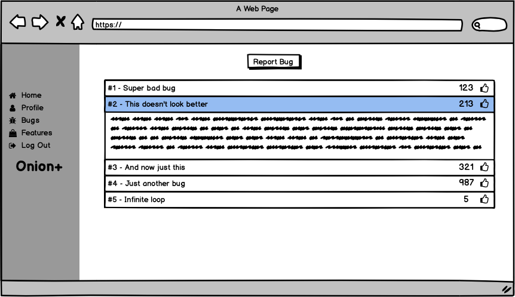
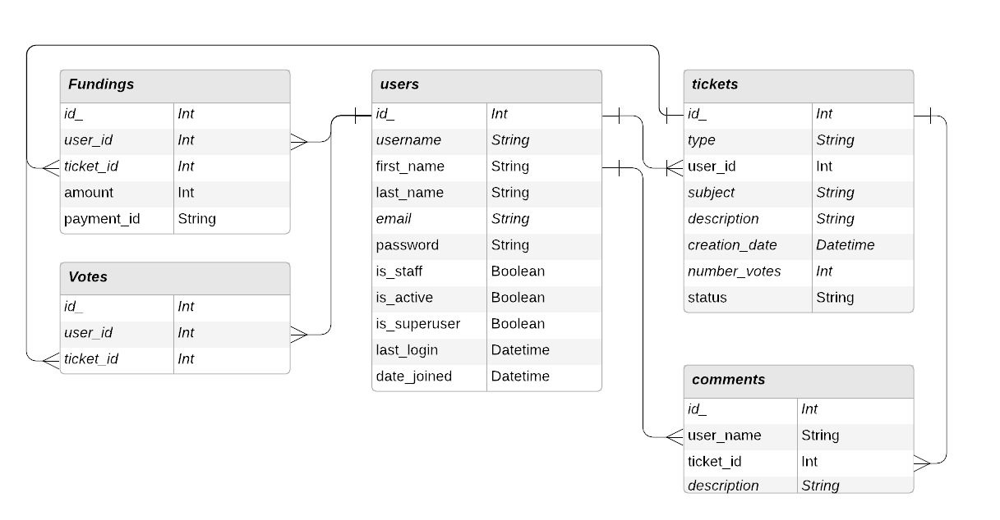

# Onion+ App

Milestone Project - Full Stack Frameworks - Code Institute

**FOR EDUCATIONAL PURPOSE ONLY**

The customer is a software development company that has a very successful web app in the market called [WesternOnion.](http://westernonion.herokuapp.com/show_all)

The customer's request is to create a web based app to handle the collection of bug reports and features requests for their app WesternOnion, so they can priotize bugs based in the number of reports received and have the users fund the development of new features requested.

The app will be named Onion+ in reference to the app it supports.
 
## UX
### User Stories

- As user, I want to be able to add reports of bugs or request new features, so I can make the most of WesternOnion.
    - **Feature:** *'+'* floating button in the pages showing all bugs and features.

- As user, I want to be able to indicate that I also suffer a bug already listed, so I don't need to report it again.
    - **Feature:** *'Thumbs Up'* button next to each bug report. Users can only *'Thumbs Up'* once each bug.

- As user, I want to know the status of a report, so I know what to expect.
    - **Feature:** Indicators of *'status, +1s and funding'* next to each report.

- As user, I want to be able to comment on reports, so my feedback can be taken into account too.
    - **Feature:** *'Comments'* feature.

- As company, I want users to pay feature requests, so we can fund development.
    - **Feature:** Stripe integration to collect payments associated with a feature request.

### Wireframes

For the skeleton element of the UX design of this project, the [balsamiq.cloud](https://balsamiq.cloud) tool was used to create the wireframes.

  

## Data Model


## Features

The site is responsive and mobile first, even if due to the simplicity achieved on the User Interface there's little difference between different screen sizes.

A collapsible sidenav has been implemented which collapses on screens smaller than medium.

Stripe is used to manage all the payments logic.

### Known Bugs

#### Log In / Sing Up modal tab indicator doesn't show on modal opening.
When the *Log In* modal opens for the first time, it shows the *Log In* tab, but the tab indicator doesn't indicate the correct tab, even if the feature is implemented according to the Materialize documentation and the element has the proper CSS *active* class added. Doing click in any of the tabs solves the problem temporarily until the page loads. The bug requires more investigation to find a permanent fix.

## Technologies Used

1. HTML
2. CSS
3. JavaScript
3. Materialize (v1.0.0) https://materializecss.com
4. Python (v.3.8.0)
5. Django (v.1.11.28)

## Testing

The site has been tested in multiple browsers Chrome & Safari in MacOS and Chrome on Android 10 phones to ensure compatibility and responsiveness.

Travis has been used for Continuous Integration testing.

The following manual tests have been carried out:
- Create a new bug & a new feature request
- Comment in a bug & a feature request
- Upvote a bug
- Make payments to support features request
- Submit payment without entering all the information required
- Submit forms without entering all the information required
- Change password entering wrong current password and unmatching passwords
- Create account entering unmatching passwords

All user stories have been checked to confirm the website offers a solution to them.

## Deployment

This site is hosted using Heroku, deployed directly from the master branch on GitHub. The deployed site will update automatically upon new commits to the master branch are pushed into GitHub and successfully pass Travis Continuous Integration tests. The deployed app can be [accessed here.](https://onionplus.herokuapp.com)

### Deployment steps:
###### On Heroku
1. Click `New` > `Create new app`
2. Enter a name for your app on Heroku, select region and click `Create app`
3. Go to `Resources` and then search `Postgres`in `Add-ons`. Select the plan that suits you.
4. Go to `Settings` and add the following `Config Vars`:
    - SECRET_KEY = (**You will need to generate a new one**)
    - STRIPE_PUBLISHABLE_KEY = (**You will need to get this from your Stripe dashboardp**)
    - STRIPE_SECRET_KEY = (**You will need to get this from your Stripe dashboardp**)
    - DATABASE_URL = (**Heroku should have filled this in**)
5. Go to `Deploy` and select GitHub in the `Deployment method`section. Authorize Heroku and select the project you want to deploy and the branch. Click `Enable Automatic Deploys`
###### On Terminal
4. Create `requirements.txt` file by typing in your terminal in the project root directory:
```
pip3 freeze --local > requirements.txt
```
5. Create a file `Procfile` with content:
```
web: gunicorn onionplus.wsgi:application
```
6. Commit your changes
7. Push to GitHub


### To run locally
You can clone this repository by typing `git clone https://github.com/jordy-silva/ci-western_onion-msp.git` into your terminal, given that git is installed in your machine. You will need a working python installed in your machine.


## Credits

### Content
- Text from the *Deployment* section of this document has been copied and adapted from Code Institute's [example project](https://github.com/Code-Institute-Solutions/StudentExampleProjectGradeFive/blob/master/README.md)

### Acknowledgements
- StackOverflow was consulted for help with different challenges during the project.
- Materialize documentation and examples have been used as base for some parts of the website.
- How to use `next` parameter to redirect to previous page when login is required was [consulted here.](https://python-decompiler.com/article/2009-04/django-redirect-to-previous-page-after-login)
- The Stripe integration is heavily based in their examples [here](https://github.com/stripe-samples/accept-a-card-payment) for use of webhooks with minor changes to adapt to the use case and the developer documentation [here](https://stripe.com/docs/payments/accept-a-payment) was also used.

[](https://travis-ci.org/jordy-silva/CI-OnionPlus-MSP)